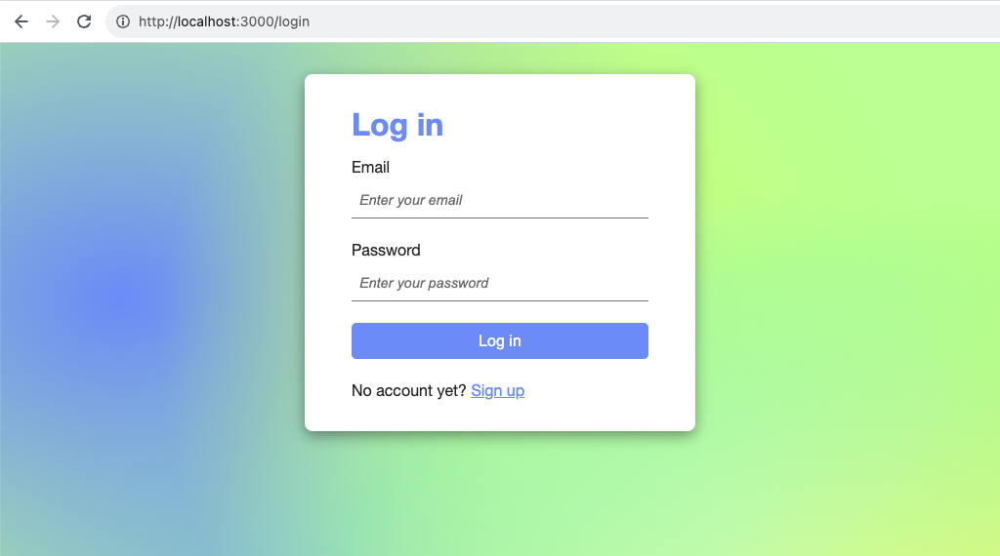
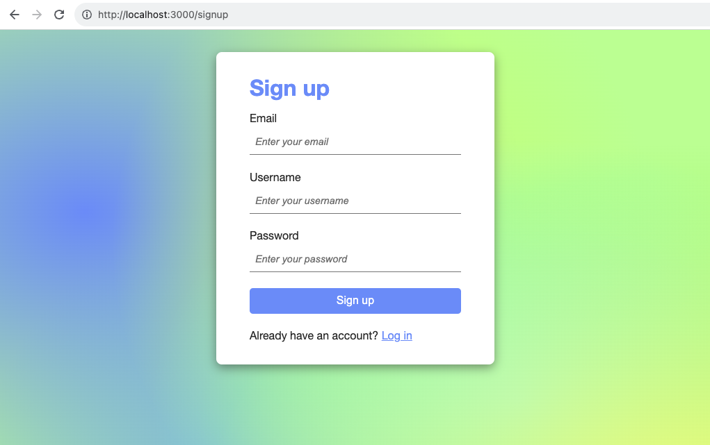
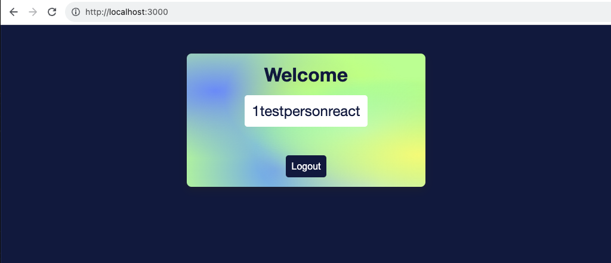

# MERN project - simple User Log-in/Sign-up

This MERN project has 2 directories. <br>
Before ANY command, ALWAYS check if you are in the correct directory! <br>
- `client` - the React.js app front-end
- `server` - the Node.js, MongoDB, Express.js back-end

## What is this about?
A small responsive web application, where a user can sign up (required are email, username, password), log in (required are email, password), and once logged in/verified, are greeted by a welcome screen that offers the possibility to log out. <br>
MERN stack is used. <br>
MongoDB and NoSQL database on MongoDB Atlas. Express.js framework for/in Node.js to benefit from out of the box functionality. React.js library for the client-side. Node.js runtime environment for the server-side.

## Screenshots
 <br>
 <br>
 <br>

- User Authentication (verification, validation of user credentials) & Authorization (access to particular areas of application, depending on level of authorization) with JSON Web Token
- bcrypt is used for password hashing
- at sign up, check will be done if user already exists (if email exists)
- if not, user will be created, token will be created
- at log in, check will be done if user already exists (if email exists)
- password will be compared (database <-> input)
- token will be created
- user will be logged in and redirected to simple welcome view

## Server (back-end)
### Dependencies
- `bcrypt` - for password hashing
- `cookie-parser` - middleware, to handle cookie-based sessions
- `cors` - middleware, to enable Cross-Origin Resource Sharing for an Express.js application
- `dotenv` - to configure and separate data that is NOT supposed to be committed (environment variables)
- `express` - Node.js framework of choice
- `jsonwebtoken` - to create and verify JSON Web Tokens
- `mongoose` - to create the data model and to connect to the database on MongoDB Atlas
- `nodemon` - to automatically restart Node.js whenever a change has been made to the code

## Client (front-end)
### Dependencies
- `react` - React.js and all of the depencencies coming with `npx create-react-app`
- `react-cookie` - universal cookies for React, handles cookie-based sessions
- `react-router-dom` - to enable client-side routing
- `react-toastify` - to add (temporaryly ugly) notifications
- `axios` - HTTP client for Node.js and the browser

## How to run this?
- clone project
- as there's a `package.json` in `client` AND a `package.json` in `server` you need to `cd` into each directory and run `npm install` in each one of them
- beware of the `.env` file which is not committed; you won't have the `MONGODB_URI`, `PORT` and `TOKEN_KEY` variables and you won't have the assigned values so the project won't work unless you set these values (see below to get an idea how to set up your `.env` file)
- `cd` into `server` first to start it with `npm start` (will listen on port 4000)
- `cd` into `client` second to start it with `npm start` (will open on http://localhost:3000 and immediately redirect to http://localhost:3000/login)
- stop server/s with `ctrl c`

## Source / Pitfalls
Project has been coded along to https://www.freecodecamp.org/news/how-to-secure-your-mern-stack-application <br>
**Heads-up, in case you also want to code along, the freecodecamp tutorial is quite error prone. Along with generally wrong tutorial code, the following should be taken into consideration:**
- you cannot create the `client` folder as it is described
  - you need to create this folder by running `npx create-react-app client`
  - `client` then is the folder/project name
- `.gitignore` needs to be moved to the parent folder `react-auth-app`
  - to successfully push EVERYTHING to a GitHub repo
  - explanation how/why is missing
- you should have experiences with
  - MongoDB, MongoDB Atlas
  - how to set up a free cluster and an (empty! you don't need content upfront!) database
  - otherwise following the tutorial is difficult
- the neutral example code shown in the tutorial how to connect to your MongoDB Atlas database is wrong
  - needs to be as shown below (at time of writing)
  - PLEASE REPLACE CONTENT BETWEEN `<`s and `>`s WITH YOUR OWN MONGODB DATA!
```
mongodb+srv://<username>:<password>@<clustername>.<randomcharactersgeneratedbymongodb>.mongodb.net/<databasename>?retryWrites=true&w=majority
```
- explanation regarding the `.env` file is bad and incomplete
  - it is not mentioned that this file of course NEEDS to be `.gitignored`
  - it is not mentioned how to handle `TOKEN_KEY`, so this keeps the app from running successfully
  - basically something as shown below (at time of writing) is needed
  - PLEASE REPLACE CONTENT BETWEEN `<`s and `>`s WITH YOUR OWN MONGODB DATA!
```
// .env file
MONGODB_URI = "mongodb+srv://<username>:<password>@<clustername>.<randomcharactersgeneratedbymongodb>.mongodb.net/<databasename>?retryWrites=true&w=majority"
PORT = 4000
TOKEN_KEY = Secret
```
- one should have experiences with Postman, otherwise following the tutorial is difficult

## ToDo
- deploy the React app on GitHub pages